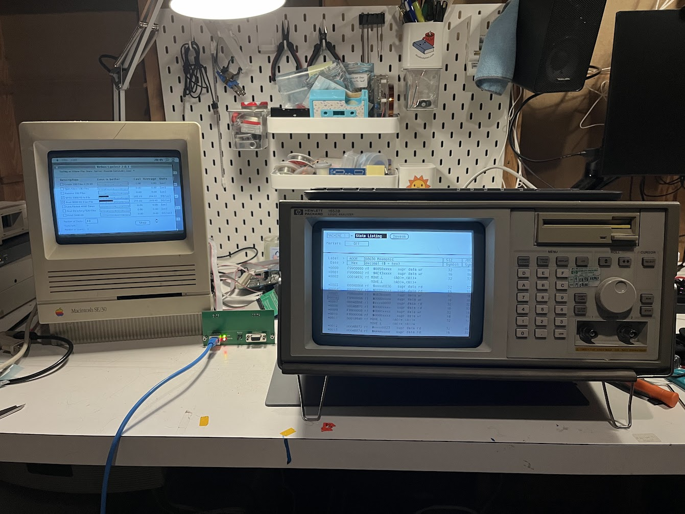
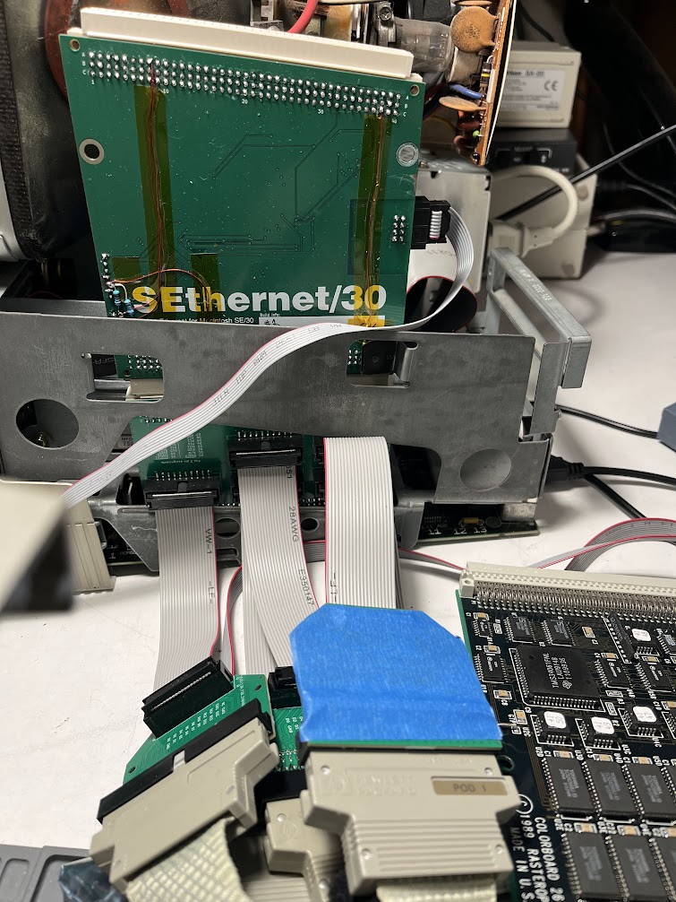

# Ersatz E2406A - a logic analyzer breakout for the Macintosh 68030 PDS slot

Logic analyzer adapter board for the Macintosh 68030 PDS slot, loosely based on
the [HP
E2406A](http://bitsavers.org/test_equipment/hp/logic_analyzer_preprocessors/E2406-97004_68030_Analysis_Probe_200106.pdf)
68030 analysis probe.

## Bill of materials

| Reference | Quantity | Description                                      | Digikey P/N  |
| --------- | -------- | ------------------------------------------------ | ------------ |
| J1        | 1        | DIN 41612 120 pin male connector, right-angle    | A1277-ND     |
| J2        | 1        | DIN 41612 120 pin female connector, right-angle  | A32307-ND    |
| J3-J7     | 5        | Surface-mount IDC header, 2.54mm pitch, 2x10 pin | 1175-1623-ND |

J2 is only required if additional PDS cards are to be connected.

## Compatibility

Tested and verified to work on the Macintosh SE/30.

Works (with limitations described below) on the Macintosh IIfx.

Should in theory work on the Macintosh IIsi, but has not been tested, and will
probably not fit without removing the logic board from the case.

### Logic Analyzer requirements

This adapter should be compatible with any HP logic analyzer having at least 80
channels (i.e. 5 or more pods). I have personally been using it with a 1650B and
1652B, but a 1660- or 1670-series analyzer should work just as well (or better)
so long as it has enough channels.

While it is possible to connect this board to a logic analyzer using flying-lead
pods, it is designed to be used with HP 01650-63203 "termination adapters" that
connect using 20-pin 0.1"-pitch connectors. I have also designed [a DIY
substitute](https://github.com/rhalkyard/hp-logic-analyzer-termination-adapter)
for these adapters, since they were an optional extra and most analyzers do not
come with them.

## Differences to the original E2406A

The original E2406A analysis probe is a board that interposes between the CPU
and CPU socket. Given the height of components surrounding the CPU socket on
Macintosh logic boards, it is unlikely that it would fit as intended on a
Macintosh. Instead, this adapter plugs into the 68030 PDS slot, which exposes
_almost_ the entire 68030 processor bus. The `/CIIN` and `/REFILL` signals are
not present on the PDS connector, but the absence of these signals does not have
significant bearing on analysis - on Macintosh systems, `/CIIN` is tied high,
and the `/REFILL` signal from the processor just provides additional low-level
information on the pipeline state.

The E2406A is an active probe with buffers on its logic analyzer outputs in
order to lessen its impact on signal integrity. In the interests of simplicity
(and cost), this adapter omits those buffers. On stock or minimally-expanded
machines, this appears to be no issue, but machines with large numbers of
expansion cards may experience instability.

The E2406A also has active logic to assist the analyzer in capturing accesses
that use the 68030's burst mode. This adapter omits this logic, and is unable to
correctly capture burst-mode accesses (only the final longword will be
captured). The only Macintosh to use burst mode is the IIfx, and as described
below, the architecture of the IIfx means that memory accesses cannot be
observed from the PDS slot anyway, so the lack of burst nmode support is moot in
this application.

## Limitations in use with the Macintosh IIfx

The architecture of the Macintosh IIfx imposes significant limitations on the
operation of this adapter. While on other machines, the PDS slot is connected
directly to the CPU and can fully 'observe' all bus transactions, the PDS slot
on the IIfx is on a buffered 'slow bus' separate from main memory and shared
only with NuBus and onboard I/O devices. As a result, when used on the IIfx,
this adapter can only capture accesses to PDS, NuBus and onboard I/O devices, and
cannot capture accesses to RAM or ROM.

## Configuration

Signals on the 5 20-pin pod connectors are assigned as below - note that the pod
assignments are somewhat arbitrary, but are set up to match the assignments
documented for the E2406A preprocessor.

| Pin | Pod function | J3 / Pod 1 | J4 / Pod 2 | J5 / Pod 3     | J6 / Pod 4 | J7 / Pod 5 |
| --- | ------------ | ---------- | ---------- | -------------- | ---------- | ---------- |
| 1   | +5V          | n/c        | n/c        | n/c            | n/c        | n/c        |
| 2   | n/c          | n/c        | n/c        | n/c            | n/c        | n/c        |
| 3   | Clock        | n/c        | n/c        | `/AS`          | n/c        | n/c        |
| 4   | Bit 15       | `D15`      | `D31`      | +5V (see note) | `A15`      | `A31`      |
| 5   | Bit 14       | `D14`      | `D30`      | +5V (see note) | `A14`      | `A30`      |
| 6   | Bit 13       | `D13`      | `D29`      | `/CBACK`       | `A13`      | `A29`      |
| 7   | Bit 12       | `D12`      | `D28`      | `/CBREQ`       | `A12`      | `A28`      |
| 8   | Bit 11       | `D11`      | `D27`      | `/HALT`        | `A11`      | `A27`      |
| 9   | Bit 10       | `D10`      | `D26`      | `/BERR`        | `A10`      | `A26`      |
| 10  | Bit 9        | `D9`       | `D25`      | `/STERM`       | `A9`       | `A25`      |
| 11  | Bit 8        | `D8`       | `D24`      | `/DSACK1`      | `A8`       | `A24`      |
| 12  | Bit 7        | `D7`       | `D23`      | `/DSACK0`      | `A7`       | `A23`      |
| 13  | Bit 6        | `D6`       | `D22`      | `FC2`          | `A6`       | `A22`      |
| 14  | Bit 5        | `D5`       | `D21`      | `FC1`          | `A5`       | `A21`      |
| 15  | Bit 4        | `D4`       | `D20`      | `FC0`          | `A4`       | `A20`      |
| 16  | Bit 3        | `D3`       | `D19`      | `SIZ1`         | `A3`       | `A19`      |
| 17  | Bit 2        | `D2`       | `D18`      | `SIZ0`         | `A2`       | `A18`      |
| 18  | Bit 1        | `D1`       | `D17`      | `R/W`          | `A1`       | `A17`      |
| 19  | Bit 0        | `D0`       | `D16`      | `/BGACK`       | `A0`       | `A16`      |
| 20  | GND          | GND        | GND        | GND            | GND        | GND        |

**NOTE:** The E2406A software assigns bits 15 and 14 of the processor status
lines on Pod 1 to be `/REFILL` and `/CIIN` respectively. These signals are not
exposed on the PDS connector. Since they are active-low, bits 15 and 14 are tied
to +5V so that they do not appear to be asserted. Without these signals, the
inverse assembler will not be able to identify pipeline-refill states or
external cache-inhibit assertions, but will otherwise function normally.

For state analysis, the analyzer should be clocked on a rising `/AS` signal
(i.e. a rising L clock when using the pod assignments above)

For analysis using the inverse assembler, labels must be created as follows:

| Label  | Contents                                   |
| ------ | ------------------------------------------ |
| `ADDR` | Address bits 31..0 (all bits of pods 5, 4) |
| `DATA` | Data bits 31..0 (all bits of pods 2, 1)    |
| `STAT` | Processor status (all bits of pod 3)       |

In addition to the `STAT` label, it may also be useful to create individual
labels for each status line, as shown in the pinout table.

## Inverse Assembler

The inverse assembler software for the E2406A will work with this adapter. A
disk image containing the inverse assembler can be found on BitSavers at
http://bitsavers.org/test_equipment/hp/logic_analyzer_preprocessors/inv_asm/68030.IMD.

Note that while the E2406A manual claims that it is only compatible with the
1660 series and newer, my 1652B and 1650B can run it just fine.

## (Lack of) warranty

This project is offered on an as-is, "works for me" basis. Feel free to do what
you want with it, but don't come crying to me if it makes your beloved vintage
Mac (or vintage logic analyzer) explode. If you build it for yourself, feel free
to sell any extras if you want, but I ask that you don't try to sell them for a
profit.
